# Managing dashboards { #dashboard }

## About the Dashboards app

The Dashboards app makes it possible to present a high level overview of your data, including displaying analytical objects such as maps, charts, reports, tables, and line lists, as well as displaying text-based information, resource links, and app widgets.

Features of the Dashboards app include:

-   View and print dashboards
-   Slideshow
-   Create and edit dashboards
-   Share dashboards with users and user groups
-   Apply temporary filters while viewing dashboards
-   Responsive view on mobile devices and small screens
-   Access dashboards while offline

## Dashboards app layout { #dashboards_setup }

Dashboards have a title, description, dashboard items. The title and actions bar is at the top of the page under the header bar, and shows the title, a dropdown for searching and selecting dashboards, and actions that can be taken with the current dashboard. There is also a **+** button for creating a new dashboard.

The Dashboards app has two modes: _view_ and _edit/create_. When you first log in
to DHIS2, your most recently used dashboard will be displayed in view mode, if you are on the same computer as you were previously. If you are using a different computer or browser, then the first starred dashboard will be displayed. If there are no starred dashboards, then the first dashboard (alphabetically) will be displayed. Starred dashboards always show first in the dashboard list.

Below is a dashboard named "Antenatal Care", which has been populated with charts and maps:

### Personalization

To adjust the Dashboards app to suit your needs, you can:

-   [Star dashboards for quick access to your favorite dashboards](#dashboard-star-dashboard)
-   [Show or hide dashboard description](#dashboard-show-description)

### Responsive view on small screens

When viewing dashboards on small screens like mobile phones, the dashboard will adapt to the screen and show all items in a single column. Some options, including editing, filtering and sharing, will not be available.

{ .center width=30% }

### Searching for a dashboard

You can search for a specific dashboard using the search field available from the Dashboards dropdown selector in the title bar. The search is case insensitive, and as you type, the list of dashboards will be narrowed down to those that match your search text.

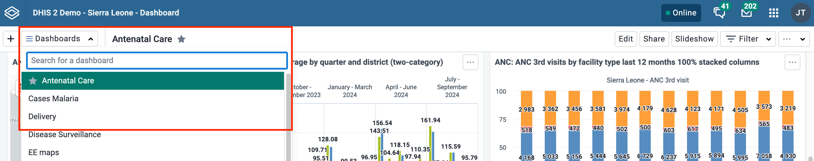

## Creating and editing a dashboard

To create a new dashboard, click the **+** button in the upper corner of the title bar to enter create/edit mode:

To edit an existing dashboard, click the **Edit** button (you must have edit access to see this button):

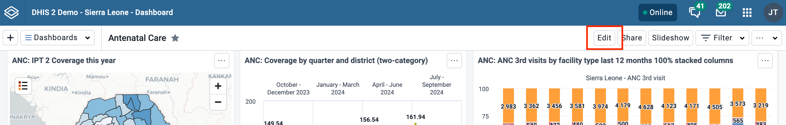

In create/edit mode, you can add or change the dashboard title, description, dashboard code and dashboard items. If you do not add a title, the dashboard will automatically be titled "Untitled dashboard".

### Adding items to the dashboard

Add items to the dashboard by searching for items using the **Search for items to add to this dashboard** dropdown selector. Item types are:

-   Visualizations (charts and pivot tables)
-   Maps
-   Line lists
-   Event reports
-   Event charts
-   Reports
-   Resources
-   Apps
-   Messages
-   Text boxes
-   Spacers

The list of items in the dropdown initially displays 10 visualizations (charts and tables), and 5 from each of the other categories, based on the search text you enter. To view more items, click on **Show more**, and the list for that type will be extended to 25 items. If you still do not find the item you want, try typing a more specific search text. Messages (Email), text boxes and spacer items can also be chosen from the list.

#### Dashboard layout and placement of new items

When adding items to the dashboard you can choose an overall layout by clicking on **Change layout** button. You can change this layout setting at any time.

-   With _Freeflow_ layout, the added items can be moved using the mouse by down-clicking on the item and dragging it to the desired position. Items can also be resized with the mouse by down-clicking on the drag handle in the lower right corner of the item and dragging to the desired size.
-   With _Fixed columns_ layout, you can choose the number of columns to have on the dashboard, and the dashboard will automatically be layed out for you. Items cannot be moved or resized in _Fixed columns_ layout. If you want to make custom adjustments to a _Fixed columns_ layout, return to a _Freeflow_ layout.

You can also configure whether newly added items are automatically placed at the start or end of the dashboard by choosing the desired option. This option can be changed at any time.

#### Spacer items

When adding items to the dashboard using _Freeflow_ layout, they will "rise" upwards until they bump into another item. In order to force empty vertical space between items (like an empty row), you can add spacer items to the dashboard. They are only visible in edit/create mode. In view mode, they are not displayed, but take up the defined space.

Spacer in **edit/create mode**:

Spacer in **view mode**:

#### Removing items

Remove items by clicking on the red trash can at the upper right of the item. Be aware that when you remove an item while in _Freeflow_ layout, the items that are positioned below the removed item will "rise" upwards until they bump into an item above. in _Fixed columns_ layout, the items will be adjusted to fill every column in the layout so there are no empty column slots.

### Actions in create/edit mode

In create/edit mode you will see the following buttons in the actions bar at the top of the page: **Save changes**, **Print preview**, **Filter settings**, **Translate**, **Delete**, and **Exit without saving**. The **Translate** and **Delete** buttons are only shown if you are editing an existing dashboard.

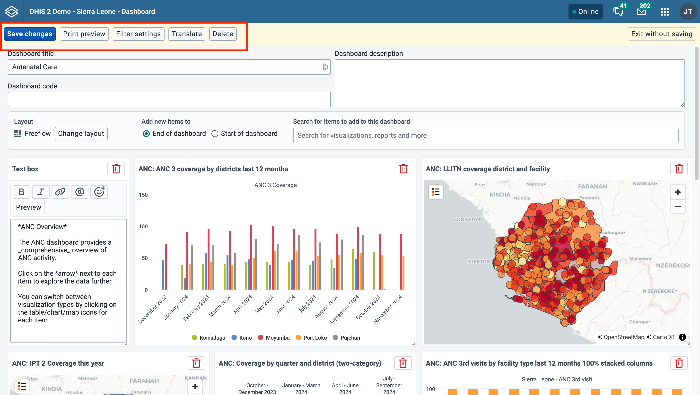

### Saving the dashboard

When creating or editing a dashboard, changes are saved when you click the **Save changes** button. If you don't want to save your changes, click the **Exit without saving** button. You will then be returned to view mode with the dashboard you were previously viewing.

### Print preview

Click on the **Print preview** button to view what the dashboard will look like when being printed with the [Dashboard layout option](#dashboard-print-layout).

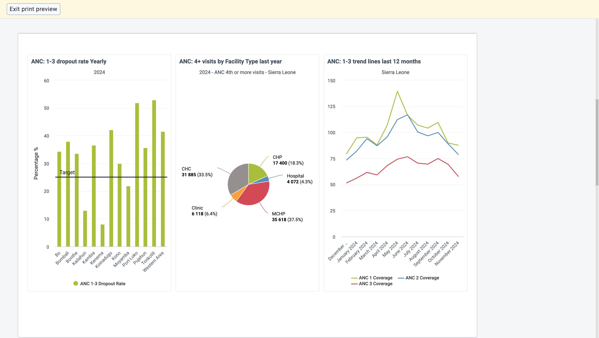

Click on **Exit print preview** to return to editing the dashboard.

Note that some items may be moved to the next page to avoid being split between two pages. Items may also be shortened to fit on one page. Items that are shortened show an info icon in the upper right corner of the item in preview. The info icon is not visible in the actual print.

### Restricting dashboard filters { #restricting-dashboard-filters }

By default, users will be able to filter dashboard items by any dimension defined in the DHIS2 instance. Dashboard filter settings can be edited for a dashboard by clicking on **Filter settings**.

To restrict available filters, you can click **Only allow filtering by selected dimensions** and select the filters you wish to allow on the dashboard. Period and Organisation Unit are selected by default but can be removed if desired. When the dashboard is viewed, users will only be able to choose from among the filters selected.

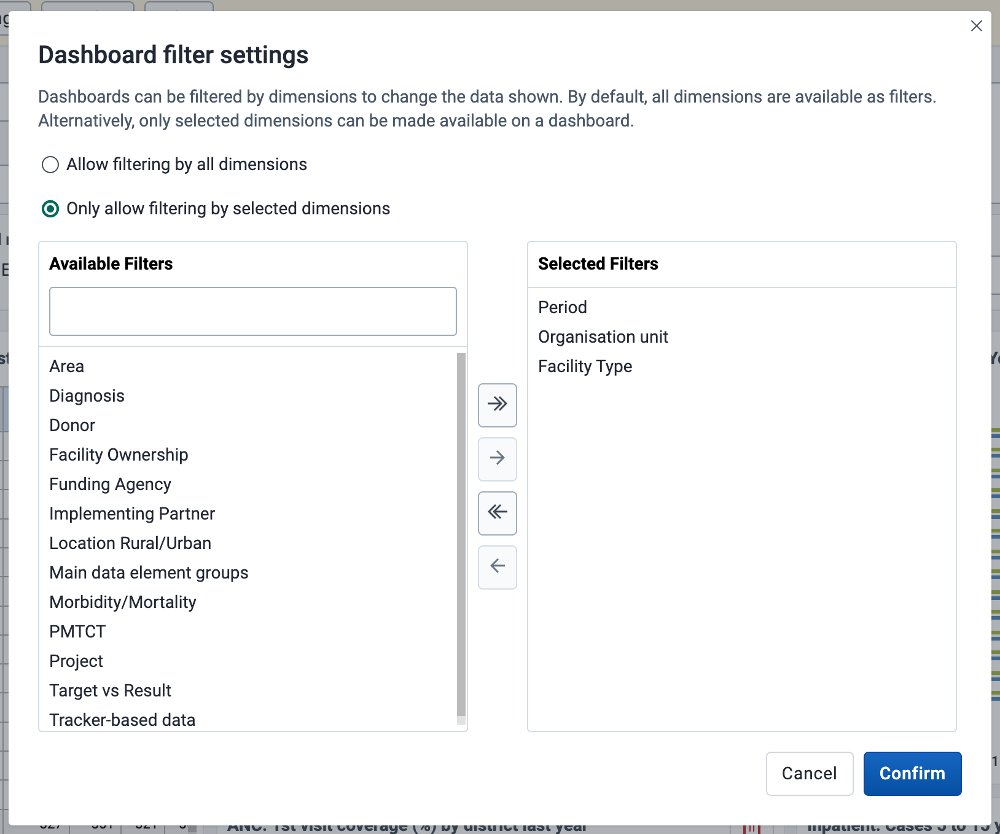{ .center width=70% }

In order to save updates to filter settings, you need to first click **Confirm** to close the Filter settings dialog and then click **Save changes** to save the dashboard changes.

### Translating dashboard title and description

If you are editing an existing dashboard, then there will be a **Translate** button. Click on this button to open the Translation dialog, which provides a list of languages to translate to, and shows the original dashboard title and description. First choose the language you want to translate for, then fill in the dashboard name and description translation.

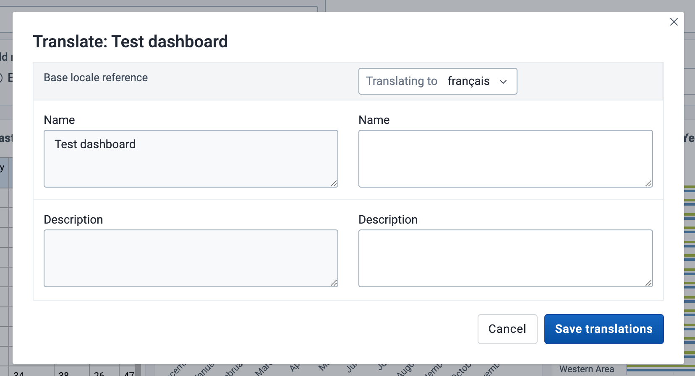{ .center width=70% }

### Deleting a dashboard

If you have access to delete the dashboard, then there will be a **Delete** button. When you click the **Delete** button, a confirmation dialog will first be displayed to confirm that you want to delete the dashboard.

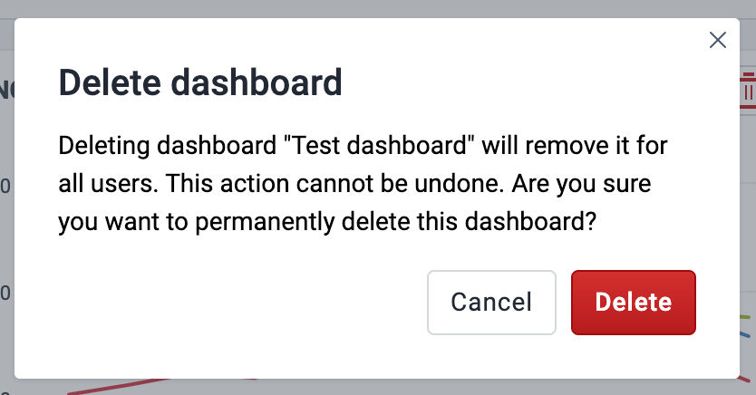{ .center width=30% }

## Viewing a dashboard

The following actions are available on the dashboard in view mode:

-   Set the show/hide description setting
-   Star the dashboard so it appears first in the dashboard list
-   Filter the dashboard
-   Print the dashboard
-   Display the dashboard in a slideshow
-   Make the dashboard available offline
-   Share the dashboard with other users and user groups
-   Close the dashboard

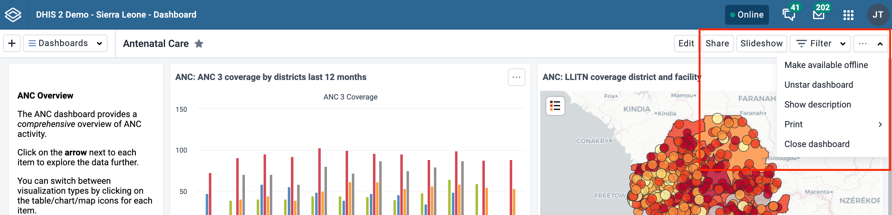

### Show description { #dashboard-show-description }

To toggle the description, open the **...** menu and choose **Show description** (or **Hide description**). This setting will be remembered for all dashboards that you open. This setting applies to you, not other users.

### Star dashboards { #dashboard-star-dashboard }

Your starred dashboards are listed first in the list of dashboards for quick access. To star a dashboard, click on the star button to the right of the title. You can also toggle the star from the **...** menu. When the star is “filled”, that means the dashboard is starred. Starring a dashboard only applies to you, not other users.

### Filter a dashboard

Applying filters to a dashboard change the data displayed in dashboard items containing visualizations. The filters are applied to each dashboard item in the same way: each added filter overrides the original value for that dimension in the original chart, table or map. It is possible to filter on Organisation Units and Periods, as well as dynamic dimensions, depending on the DHIS2 instance. You can apply multiple filters to the dashboard.

To add a filter, click on the **Filter** button and choose a dimension:

A dialog opens where the filter selection can be made.

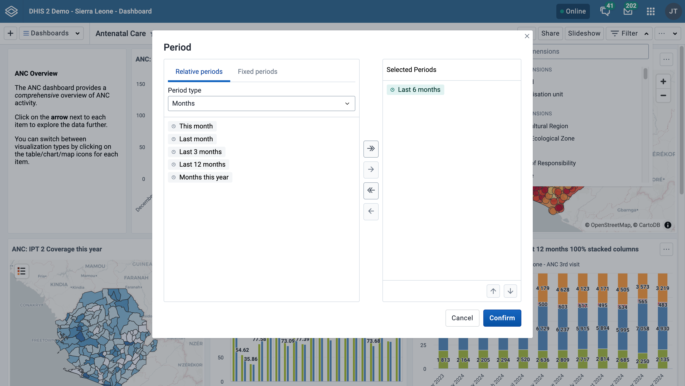

Click on **Confirm** in the dialog to apply the filter to the
current dashboard.

Filters are not stored, so when switching to a different dashboard they are reset. Black filter badges appear above the dashboard items to indicate which filters have been applied to the dashboard's visualizations.

You can edit a filter by clicking on the filter badge to open the filter selection dialog. A filter can be removed by clicking on the **Remove** button on the badge. Whenever a filter is added, edited or removed, the dashboard items reload to show the updated data. The filter badges are always visible at the top of the page when scrolling the dashboard content.

By default, users are able to filter dashboard items by any dimension defined in the DHIS2 instance. To limit available filters, see [Restricting dashboard filters](#restricting-dashboard-filters).

### Display the dashboard in a slideshow { #dashboard-slideshow }

The dashboard can be displayed in a slideshow by clicking on the **Slideshow** button.

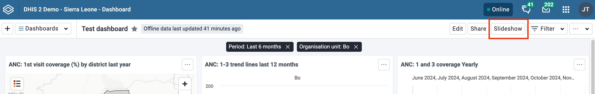

When you enter the slideshow, you'll find navigation buttons and an exit button in a navigation bar at the bottom of the page. You can also navigate with the forward and back arrow keys on the keyboard, and exit the slideshow with the **esc** key. Any filters that are applied will be displayed in the navigation bar. Note that messages and spacer items are not displayed in the slideshow.

### Make dashboards available offline

To make a dashboard available offline, choose the **Make available offline** option in the **...** menu. This will cause a reload of the dashboard where requests to the server are recorded and saved in browser storage. Note that offline dashboards are only available on the computer and browser where you set it to offline. If you currently have a filter applied when requesting the dashboard be made available offline, a dialog will appear to confirm the removal of the filters.

Dashboards that have been saved for offline display a tag next to the dashboard title showing the time it was saved. In the dashboard selector, an icon is displayed if the dashboard is available offline.

If the dashboard has been changed since you made it available offline, either by you or someone else, you'll need to choose **Sync offline data now** from the **...** menu to save the latest version of the dashboard.

You can remove a dashboard from offline storaged by choosing **Remove from offline storage** in the **...** menu.

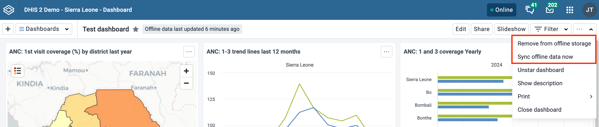

#### Other notes about Dashboards app when you are offline:

If you manually log out of the DHIS2 instance, all cached dashboards will be cleared and they will no longer be available offline.

If you are offline, any buttons or actions that require a connection to complete successfully are disabled. They will be re-enabled once connectivity is restored.

### Printing a dashboard

From the **...** menu you can print the current dashboard. There are two styles of dashboard print: _Dashboard layout_ and _One item per page_. For both styles, a title page is added that shows the dashboard title, description (if the _Show description_ setting is enabled), and any applied dashboard filters.

For best print results:

-   use Chrome or Edge
-   wait until all dashboard items have loaded before printing
-   use A4 landscape setting with default margins set and background graphics turned on

#### Print dashboard layout { #dashboard-print-layout }

_Dashboard layout_ print will approximate the dashboard layout as it is shown in the browser. Note that some adjustments may need to be made to the layout in order to prevent items being split onto multiple pages: items that would be cut off by a page break are moved to the next page, and items that are taller than one page are shortened to fit on one page.

Once in print mode, click on the **Print** button in the upper right to trigger the browser print functionality.

#### Print one item per page

This style of print will print each dashboard item on a separate page, maximizing the use of the paper size.

Click on the **Print** button in the upper right to trigger the browser print functionality.

## Dashboard items with charts, pivot tables, maps and line lists

Dashboard items with charts, pivot table, maps, line lists, event reports and event charts may have an item menu button in the upper right corner of the item with additional viewing options, depending on the system settings that have been configured for the DHIS2 instance. If all the relevant system settings have been disabled by the DHIS2 instance, then there will not be an item menu button. Here are the possible item menu options:

### Switching between visualizations

It is possible to toggle the visualization view of charts, pivot tables and maps, and between event charts and reports. Click on the item menu button and choose the desired view (e.g., **View as Table**, **View as Map**, **View as Chart**):

### View item in fullscreen

To view the chart, table, map or line list in fullscreen, click on the **View fullscreen** option. To exit fullscreen, you can either press **esc** key or click the exit button in the upper right corner of the fullscreen view. Note that you actually enter the slideshow, and can then use the navigation bar as described in the [Slideshow section](#dashboard-slideshow) to navigate to other dashboard items in fullscreen.

### Open in app

To open the visualization in its corresponding app (e.g., Data Visualizer, Maps) click on the **Open in [app name] app** option.

### Show interpretations and details

You can write interpretations for charts, pivot tables, maps, line lists, event reports, and event charts by clicking on **Show interpretations and details**. The item will be expanded vertically underneath to show the description, interpretations and replies:

You can like an interpretation, reply to an interpretation, and add your own interpretations. You can edit, share or delete your own interpretations and replies, and if you have moderator access, you can delete others’ interpretations.

It is possible to format interpretation text with **bold**, _italic_ by using the Markdown style markers \* and \_ for **bold** and _italic_ respectively. The text field for writing new interpretations has a toolbar for adding rich text. Keyboard shortcuts are also available: Ctrl/Cmd + B and Ctrl/Cmd + I. A limited set of smilies is supported and can be used by typing one of the following character combinations: :) :-) :( :-( :+1 :-1. URLs are automatically detected and converted into a clickable link.

Interpretations are sorted in descending order by date, with the most recent shown on top. Interpretation replies are sorted in ascending order by date, with the oldest shown on top.

{ .center width=50% }

## Share the dashboard { #dashboard_sharing }

In order to share the dashboard with users and user groups, click on the **Share** button to the right of the dashboard title to display the _Sharing and access_ dialog.

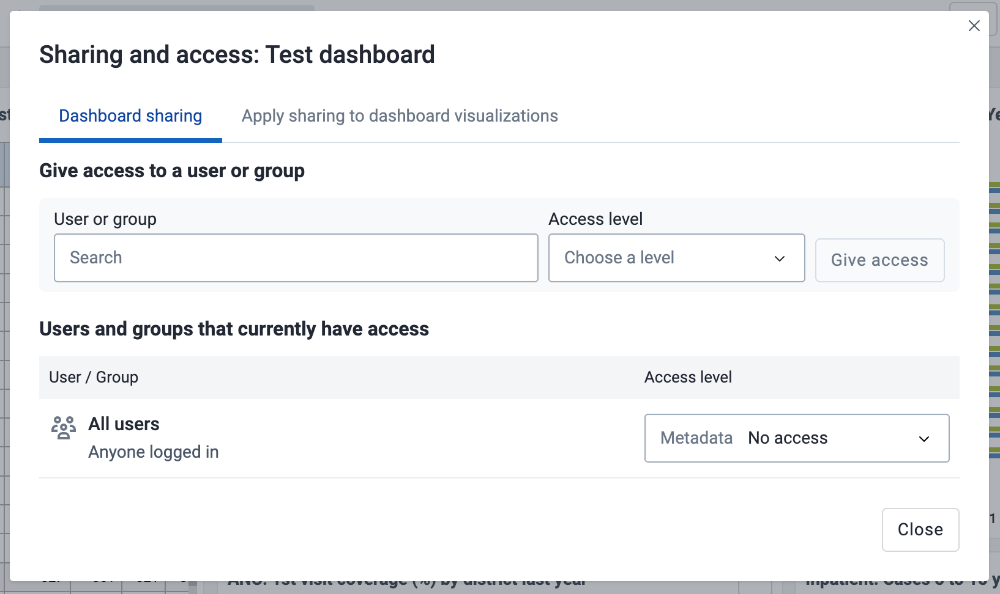{ .center width=70% }

There are three levels of sharing permissions available for a dashboard:

-   No access

    The user or user group cannot view or edit the dashboard. If they try to access the dashboard with the url, the Dashboards app will display the message "Requested dashboard not found".

-   View only

    The user or user group can view the dashboard but cannot edit it.

-   View and edit

    The user or user group can view and edit the dashboard. This level of sharing allows for all types of changes, including altering the layout, resizing and removing items, renaming and deleting the dashboard, etc.

All dashboards have the _All users_ group set to **No access** by default. The _All users_ group includes all logged-in users.

### Add users and user groups

To share a dashboard with specific users and user groups, type the name in the input field, choose the desired access level and click on **Give access**.

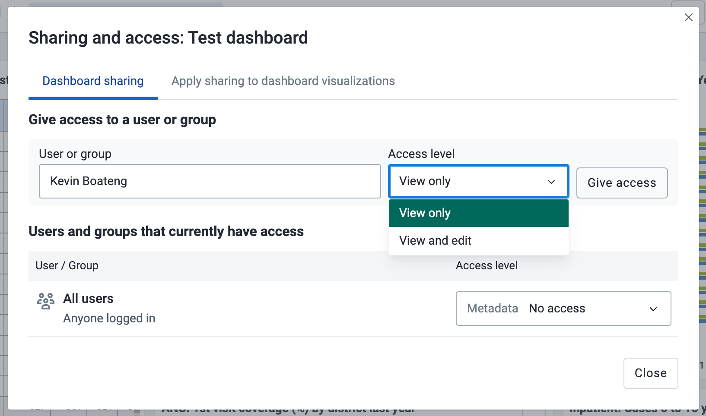{ .center width=70% }

You can provide users with the url of the dashboard, allowing them to navigate directly to the dashboard. To get the dashboard url, just open the dashboard in view mode, and copy the browser url. For example, the url to the Antenatal Care dashboard in play.dhis2.org/dev is:

https://play.dhis2.org/dev/dhis-web-dashboard/#/nghVC4wtyzi

### Cascade sharing of visualizations on the dashboard

To ensure that all charts, maps and tables on the dashboard are shared with the chosen users and user groups, click on the **Apply sharing to dashboard items** button.

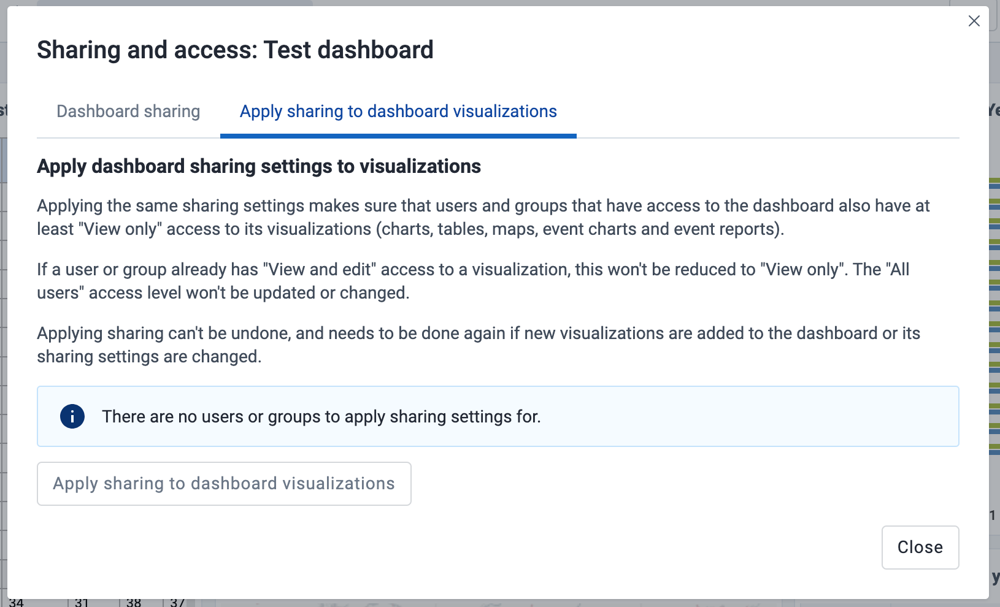{ .center width=70% }
