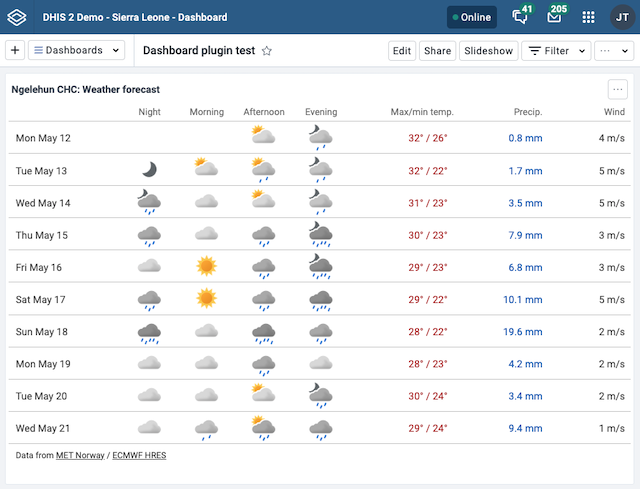

Developing a dashboard plugin is almost the same as developing a regular DHIS2 custom app. However, there are some differences in how you structure your plugin and how you configure it to work with the DHIS2 Dashboard app. These are outlined in the few steps below.

Here is an example of a dashboard plugin developed according to this documentation.



## Step 1: Create a new DHIS2 custom app

To create a new DHIS2 custom app, you can use the D2 CLI.

The D2 CLI helps you with many things, such as setting up a new project, building your app, and deploying it to your DHIS2 instance.

Please read our documentation on the [D2 CLI](/docs/quickstart/quickstart-web) to learn more about how to use it.

```sh
d2 app scripts init my-dashboard-plugin
```

## Step 2: Add a plugin entrypoint

To make your custom app a form field plugin, you need to add a plugin entrypoint inside the `d2.config.js` file.

Here is an example of how you can add a plugin entrypoint:

```js
module.exports = {
    type: 'app',
    name: 'Dashboard Plugin',

    // highlight-start
    pluginType: 'DASHBOARD',
    // highlight-end

    entryPoints: {
        app: './src/App.tsx',
        // highlight-start
        plugin: './src/Plugin.tsx',
        // highlight-end
    },
}
```

## Step 3: Develop your plugin

Develop your plugin using React components. This is the same as developing a regular DHIS2 custom app.

A dashboard plugin does not need any integration with the Dashboard app in order to work, however the plugin framework implements a two-way communication between the Dashboard app and the plugins.
This opens up for a better integration and user experience.

The plugin component defined as the entrypoint receives the following props:

-   **dashboardItemId**: each dashboard item has an unique id; this can be used to store different configurations of the plugin and have multiple instances of the plugin in the same dashboard
-   **dashboardItemFilters**: an object with the global filters applied to the dashboard (ou, pe, other dimensions):

```ts
{
    ou: [{
        id: "OI0BQUurVFS",
        name: "Bumban MCHP",
        path: "/ImspTQPwCqd/fdc6uOvgoji/fwH9ipvXde9/OI0BQUurVFS"
    }],
    pe: [{
        id: "THIS_MONTH",
        name: "This month"
    }],
    uIuxlbV1vRT: [{
        id: "nlX2VoouN63",
        name: "Eastern Area"
    }]
}
```

-   **dashboardMode**: indicates if the dashboard is in `view`, `edit` or `print` mode; it can be used for example for showing the configuration interface when in edit mode and the content when in view mode
-   **setDashboardItemDetails**: a callback function the plugin can call to pass a custom title and URL and a callback function called when the dashboard item containing the plugin is removed from the dashboard:

```ts
setDashboardItemDetails({
    itemTitle: 'Custom title',
    appUrl: '<https://your.dhis2/instance/api/apps/custom-app/index.html#/path/to/some/page>',
    onRemove: () =>
        new Promise((resolve, reject) =>
            cleanup().then(resolve()).catch(reject())
        ),
})
```

All of the above details are not required.

The `onRename` callback does not block the dashboard app from removing a dashboard item, regardless of the outcome.
It's only useful to the plugin for internal clean up purposes, for example when a plugin stores configurations by dashboard item id and wants to clear them up when dashboard items are removed.

## Step 4: Build and deploy your plugin

After you have developed your plugin, you need to build and deploy it to your DHIS2 instance.

To build your plugin, you can use the provided build script from `d2-app-scripts`.

Run `yarn build` or (`d2-app-scripts build`) to build a production version of your plugin.

After building your plugin, you can deploy it to your DHIS2 instance.
You can do this by uploading the ZIP file to the _App management_ app in your DHIS2 instance, or publishing it to the App Hub.

## Step 5: Using the plugin in Dashboard app

Once deployed the plugin should appear listed under the Apps section in the item selector, and can be added to a dashboard like any other item.
