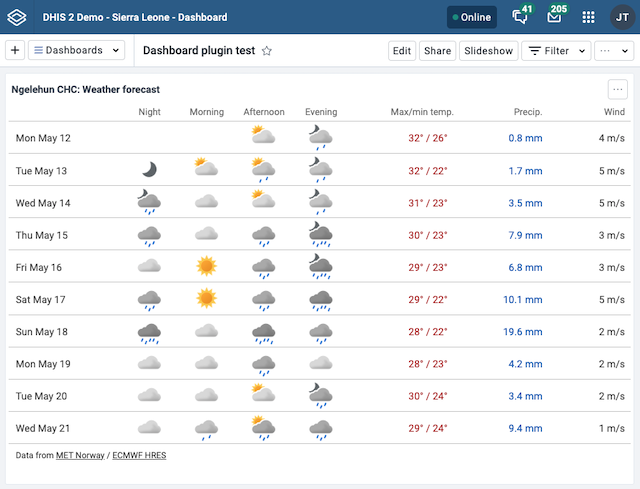

Implementing a dashboard plugin is very similar to implementing a regular DHIS2 custom app, with a few differences in how you configure it to work with the DHIS2 Dashboard app. These are outlined in the steps below.

Here's an example of a dashboard plugin implemented following this documentation.



## Step 1: Create a DHIS2 custom app

To create a DHIS2 custom app, you can use the D2 CLI to simplify several aspects of maintaining a custom app, including setting up a new project, building the app, and deploying it to your DHIS2 instance.

Please read the documentation on the [D2 CLI](/docs/quickstart/quickstart-web) to learn more about how to use it.

```sh
d2 app scripts init my-dashboard-plugin
```

## Step 2: Add a plugin entry point

To make your custom app a dashboard plugin, set the `pluginType` property to `"DASHBOARD"` and add a `plugin` property to the `entryPoints` property containing the path to the Plugin entry point file:

Below is an example of a `d2.config.js` file configured with a Dashboard plugin.

```js
module.exports = {
    type: 'app',
    name: 'Dashboard Plugin',

    // highlight-start
    pluginType: 'DASHBOARD',
    // highlight-end

    entryPoints: {
        app: './src/App.tsx',
        // highlight-start
        plugin: './src/Plugin.tsx',
        // highlight-end
    },
}
```

:::tip
Note that an `app` entry point is not required if a `plugin` entry point is defined.
:::

## Step 3: Implement your plugin

Implement your plugin using React components, just as you would implement a regular DHIS2 custom app.

The dashboard plugin does not need any integration with the Dashboard app in order to work. However, the new plugin framework adds two-way communication between the Dashboard app and the plugin that enables an enhanced user experience. This is done via properties that the Dashboard app provides to the plugin:

-   **dashboardItemId**: each dashboard item has an unique id; this can be used to store different configurations of the plugin and allow multiple instances of the plugin in the same dashboard
-   **dashboardItemFilters**: an object with the global filters applied to the dashboard (organisation unit, period, other dimensions):

```ts
{
    ou: [{
        id: "OI0BQUurVFS",
        name: "Bumban MCHP",
        path: "/ImspTQPwCqd/fdc6uOvgoji/fwH9ipvXde9/OI0BQUurVFS"
    }],
    pe: [{
        id: "THIS_MONTH",
        name: "This month"
    }],
    uIuxlbV1vRT: [{
        id: "nlX2VoouN63",
        name: "Eastern Area"
    }]
}
```

-   **dashboardMode**: indicates whether the dashboard is in `view`, `edit` or `print` mode; it can be used, for example, for showing the configuration interface when in edit mode and the content when in view mode
-   **setDashboardItemDetails**: a callback function the plugin can call to pass a custom title, a URL, and a callback function named `onRemove`, which is called when the dashboard item containing the plugin is removed from the dashboard. It is not necessary to set all the properties if only one or two of them are needed:

```ts
setDashboardItemDetails({
    itemTitle: 'Custom title',
    appUrl: '<https://your.dhis2/instance/api/apps/custom-app/index.html#/path/to/some/page>',
    onRemove: () =>
        new Promise((resolve, reject) =>
            cleanup().then(resolve()).catch(reject())
        ),
})
```

The `onRemove` callback does not block the Dashboard app from removing a dashboard item, regardless of the outcome.
Its purpose is to trigger the plugin's own internal clean up, for example when a plugin stores configurations by dashboard item id and wants to delete them when dashboard items are removed.

### Using the props from the Dashboard

The props from the Dashboard app are passed as React props to the component that's exported from the file specified by the `plugin` entry point in `d2.config.js`:

```js title="src/Plugin.tsx"
const DashboardPlugin = ({
    dashboardItemId,
    dashboardItemFilters,
    dashboardMode,
    setDashboardItemDetails,
}) => {
    // Your plugin components here...
}
export default DashboardPlugin
```

## Step 4: Build and deploy your plugin

After you have implemented your plugin, you need to build and deploy it to your DHIS2 instance.

To build your plugin, you can use the provided build script from `d2-app-scripts`.

Run `yarn build` or (`yarn d2-app-scripts build`) to build a production version of your plugin.

After building your plugin, you can deploy it to your DHIS2 instance.
You can do this by uploading the ZIP file to the _App management_ app in your DHIS2 instance, using the [`@dhis2/cli-app-scripts` deploy command](http://localhost:3000/docs/app-platform/scripts/deploy), or publishing it to the App Hub.

## Step 5: Using the plugin in Dashboard app

Once deployed, the plugin should appear listed under the Apps section in the Dashboard item selector (`edit` mode), and can be [added to a dashboard](https://docs.dhis2.org/en/use/user-guides/dhis-core-version-master/analysing-data/dashboards.html#adding-items-to-the-dashboard) like any other item.
